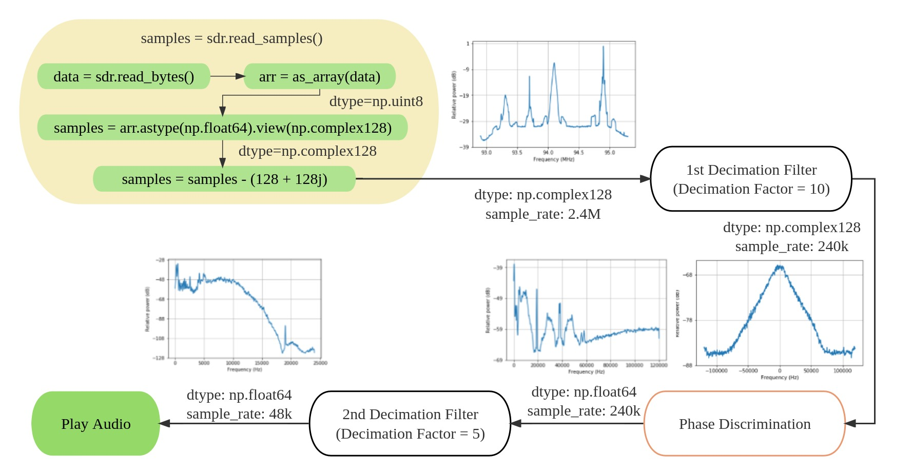
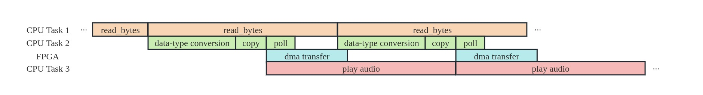

# Hardware Acceleration of FM Demodulation Algorithms

# 1 Introduction

In this project, we have accelerated FM demodulation algorithms using HLS, making it possible to stream FM audios (i.e., demodulate the data into audios in real time). Based on that, we have developed a simple FM radio receiver applet in the Jupyter Notebook.

## 1.1 An Overall View

First, we provide an overall view of what is happening during the whole FM demodulation process.



As shown in the flow chart above, the steps of the signal processing can be summarized as follows:

 1. The raw data (`uint8`) is converted to `np.complex128` data type. The details are listed as follows:
    * The RTL-SDR reads in unsigned 8-bit data (`np.uint8`) via USB 2.0. The order of the data is `I0[7:0], Q0[7:0], I1[7:0], Q1[7:0], ...`.
    * The `uint8` bytes are converted into 64-bit float (`np.float64`).
    * The 64-bit data are reinterpreted as 128-bit complex numbers. The `np.complex128` is a native data type provided by `numpy`. It is stored in RAM as in the order `real[0], imag[0], real[1], imag[1], ...`.
    * All `np.complex128` numbers are substracted by `(128 + 128j)`. This is because the original data type is `uint8`, which ranges from 0 to 255, and we should subtract by 128 to get a range from -128 to 127.
 2. The complex data are passed through a decimation filter with a factor of 10. The sample rate of the signal is divided by 10. The sample rate is decreased from 2.4M to 240k.
 3. The filtered and decimated complex data are passed through a phase discriminator. The phase discriminator takes complex data in, and output the difference of the phase (argument) of the complex data.
 4. The phase-discriminated data are again passed through a second decimation filter with a factor of 5, so that the sample rate of the signal is divided by 5. The sample rate is decreased from 240k to 48k.

The (pseudo-)code is as follows:

```python
data = sdr.read_bytes()
arr = as_array(data) # np.uint8, len = 4.8M
samples = arr.astype(np.float64) # convert uint8 to float64
samples = samples.view(np.complex128) # len = 2.4M
samples = samples - (128 + 128j)
# the above is equivalent to
# samples = sdr.read_samples()
samples_1 = decimation_filter_1(samples) # np.complex128, len = 240k
samples_discriminated = fm_discrim(samples_1) # np.float64, len=240k
samples_2 = decimation_filter_1(samples_discriminated) # np.float64, len=48k
IPython.display.Audio(samples_2) # play the audio
```

For details, see [notebook 01](board/notebooks/01-Demodulating_FM_Signals.ipynb).

## 1.2 Algorithms

### 1.2.1 Decimation Filtering

By "decimation filtering" we mean the signal is first filtered and then decimated. Decimation is just a fancy way of saying "downsampling", i.e., picking one sample from every M samples. We refer to M as the "decimation factor".

Let us denote the FIR filter coefficients by $c[i],\,(i=0,\cdots,N-1)$, the input signal by $x[i]$, and the output signal by $y[j]$, then we have

$$
y[j] = \sum_{i=0}^{N-1} c[i]x[M\cdot j+i],
$$

where $M$ is the decimation factor.

### 1.2.2 Phase Discrimination

Let us denote the signal to be discriminated by $y$, and the discriminated signal by $z$, then we have

$$
z = \frac{\mathrm{d}}{\mathrm{d}t} \arctan \frac{\mathrm{Im}(y)}{\mathrm{Re}(y)}
    = \frac{\mathrm{Re}(y)\cdot [\mathrm{Im}(y)]^\prime - \mathrm{Im}(y)\cdot [\mathrm{Re}(y)]^\prime}{[\mathrm{Re}(y)]^2+[\mathrm{Im}(y)]^2},
$$

where $\mathrm{Re}$ and $\mathrm{Im}$ stand for taking the real and the imaginary part of a complex number.

This is the core step of FM demodulation.

We can rewrite the above equation into its discrete form

$$
z[k] = \frac{I[k](Q[k] - Q[k-1]) - Q[k](I[k] - I[k-1])}{I[k]^2+Q[k]^2},
$$

further simplified as

$$
z[k] = \frac{Q[k]I[k-1]-I[k]Q[k-1]}{I[k]^2+Q[k]^2}.
$$

Therefore, we have convert the `arctan` operation into simple arithmetic operations, which is more suitable for the hardware.

## 1.3 Design Considerations

Now we introduce the purpose of decimation filtering.

The first and second filter involved in the design are both low-pass filters (LPF).

The purpose of the first LPF is to

- select out the center frequency band, which is of our interest;
- perform anti-aliasing before decimation (downsampling)

The purpose of the second LPF is to

- perform anti-aliasing before decimation (downsampling)

The purpose of oversampling followed by decimation is to

- Reduce noise.
  When oversampling by a factor of $N$, the signal-to-noise ratio (SNR) increases by $\sqrt{N}$ (if the noises are uncorrelated).
- Make it easier to design an anti-aliasing filter.
  Oversampling the signal allows for the implementation of anti-aliasing filters with lower complexity. By sampling the signal at a higher rate, it becomes easier to design filters with a narrower transition band, reducing the amount of aliasing artifacts that could occur when the signal is subsequently downsampled.
- Increase resolution.
  By increasing the sampling rate, the resolution of the signal is improved, allowing for better representation of both small and large amplitude variations.

For more details about design considerations and the selection of parameters (filter coefficients and decimation factors), see [notebook 01](board/notebooks/01-Demodulating_FM_Signals.ipynb).

# 2 Hardware Acceleration

## 2.1 Baseline Implementation

Now we want to offload some CPU-intensive operations to the PL. In the baseline implementation, we have offloaded the following operations:

```python
# This is a pseudocode!
# IP 1: fir_complex
samples = samples - (128 + 128j)
samples_1 = decimation_filter_1(samples)
# IP 2: fm_discrim
samples_discriminated = fm_discrim(samples_1)
# IP 3: fir_real
samples_2 = decimation_filter_1(samples_discriminated)
```

The baseline implementation can be found at `hls/`.

The version of Vitis HLS is 2020.2.

## 2.2 Optimization Guidelines

To achieve real-time processing, we must optimize the data flow so that the throughput of FM demodulation is larger than the sampling rate of the incoming signals. For example, if the incoming signals have a sampling rate of 2.4M, then the throughput must be greater than 2.4M in order to achieve real-time streaming. The baseline implementation has achieved a throughput of >6M.

To further optimize the project, we can consider the following:

1. Integrate the three IPs into a single IP.
   The critical path of the design is determined by the first IP (the first decimation filter) because it deals with signals with the highest sampling rate. By integrating the three IPs together, it is easier to minimize unnecessary area cost of the following two IPs.
2. Offload more CPU operations (such as data type conversion) to the FPGA.
3. Filtering Algorithm
   a. change the FIR from the direct form structure to other structures, such as the transposed form and the cascade structure.
   b. implement complex filters that involve the cross-operation between the imaginary and real parts of complex numbers, which is more efficient in terms of hardware resources.
   c. implement CIC filters which consume even less area.

The possible optimization techniques are not limited to the above.

# 3 Streaming the Audio

For streaming the audio, the `asyncio` library is used. See [notebook 04](board/notebooks/04-FM_Radio_Player_App.ipynb).

`asyncio` is a powerful library in Python that provides a foundation for writing asynchronous, concurrent, and event-driven code. It was introduced in Python 3.4 and has since become a fundamental part of the Python ecosystem for building scalable and efficient applications.



As shown in the above picture, there are three CPU tasks and one FPGA task. The first CPU task is to receive the raw data from the RTL-SDR, the second CPU task is to perform some necessary CPU operations (data-type conversion, copying data, and polling UI events), and the third CPU task is to play the audio. The main part of the algorithm has been offloaded to the FPGA and is denoted by "dma transfer" in the picture. Since the throughput of DMA is larger than the sampling rate, we can play the audio immediately after initializing a DMA transfer.
