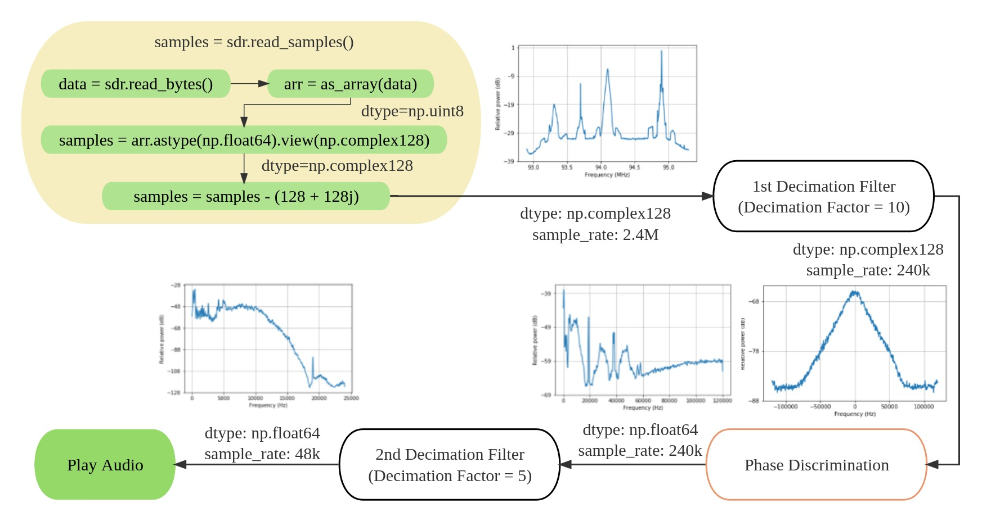
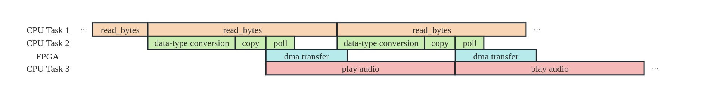

# 1 Demodulating FM Signals

## 1.1 An Overall View

First, we provide an overall view of what is happening during the whole FM demodulation process.



As shown in the flow chart above, the steps of the signal processing can be summarized as follows:

1. The RTL-SDR reads in unsigned 8-bit data (`np.uint8`) via USB 2.0. The order of the data is `I0[7:0], Q0[7:0], I1[7:0], Q1[7:0], ...`.
2. The `uint8` bytes are converted into 64-bit float (`np.float64`).
3. The 64-bit data are reinterpreted as 128-bit complex numbers. The `np.complex128` is a native data type provided by `numpy`. It is stored in RAM as in the order `real[0], imag[0], real[1], imag[1], ...`.
4. All `np.complex128` numbers are substracted by `(128 + 128j)`. This is because the original data type is `uint8`, which ranges from 0 to 255, and we should subtract by 128 to get a range from -128 to 127.

The (pseudo-)code is as follows:

```python
data = sdr.read_bytes()
arr = as_array(data) # np.uint8, len = 4.8M
samples = arr.astype(np.float64) 
samples = samples.view(np.complex128) # len = 2.4M
samples = samples - (128 + 128j)
# the above is equivalent to
# samples = sdr.read_samples()
samples_1 = decimation_filter_1(samples) # np.complex128, len = 240k
samples_discriminated = fm_discrim(samples_1) # np.float64, len=240k
samples_2 = decimation_filter_1(samples_discriminated) # np.float64, len=48k
IPython.display.Audio(samples_2) # play the audio
```

For details, see the notebook `board/notebooks/01-Demodulating_FM_Signals.ipynb`.

## 1.2 Algorithms

### 1.2.1 Decimation Filtering

By "decimation filtering" we mean the signal is first filtered and then decimated. Decimation is just a fancy way of saying "downsampling", i.e., picking one sample from every M samples. We refer to M as the "decimation factor".

Let us denote the FIR filter coefficients by $c[i],\,(i=0,\cdots,N-1)$, the input signal by $x[i]$, and the output signal by $y[j]$, then we have

$$
y[j] = \sum_{i=0}^{N-1} c[i]x[M\cdot j+i],
$$

where $M$ is the decimation factor.

!!! A picture demonstrating decimation filtering TBD here.

### 1.2.2 Phase Discrimination

Let us denote the signal to be discriminated by $y$, and the discriminated signal by $z$, then we have

$$
z = \frac{\mathrm{d}}{\mathrm{d}\,t} \arctan \frac{\mathrm{Im}(y)}{\mathrm{Re}(y)}
    = \frac{\mathrm{Re}(y)\cdot [\mathrm{Im}(y)]^\prime - \mathrm{Im}(y)\cdot [\mathrm{Re}(y)]^\prime}{[\mathrm{Re}(y)]^2+[\mathrm{Im}(y)]^2},
$$

where $\mathrm{Re}$ and $\mathrm{Im}$ stand for taking the real and the imaginary part of a complex number. This is the core step of FM demodulation.

We can rewrite the above equation into its discrete form

$$
z[k] = \frac{I[k](Q[k] - Q[k-1]) - Q[k](I[k] - I[k-1])}{I[k]^2+Q[k]^2},
$$

further simplified as

$$
z[k] = \frac{Q[k]I[k-1]-I[k]Q[k-1]}{I[k]^2+Q[k]^2}.
$$

Therefore, we have convert the `arctan` operation into simple arithmetic operations, which is suitable for hardware implementation.

### 1.2.3 Filter Design Considerations

!!! TBD

# 2 Hardware Acceleration

## 2.1 Baseline Implementation

Now we want to offload some CPU-intensive operations to PL. In the baseline implementation, we have offloaded the following operations:

```python
# This is a pseudocode!
# IP 1: fir_complex
samples = samples - (128 + 128j)
samples_1 = decimation_filter_1(samples)
# IP 2: fm_discrim
samples_discriminated = fm_discrim(samples_1)
# IP 3: fir_real
samples_2 = decimation_filter_1(samples_discriminated)
```

The baseline implementation can be found at `hls/*/src/`.

## 2.2 Optimization Guidelines

!!! TBD
to achieve real-time processing, we need to ...

# 3 Streaming the Audio (Optional)

For streaming the audio, the `asyncio` library is used.

`asyncio` is a powerful library in Python that provides a foundation for writing asynchronous, concurrent, and event-driven code. It was introduced in Python 3.4 and has since become a fundamental part of the Python ecosystem for building scalable and efficient applications.

!!! Explanation TBD


